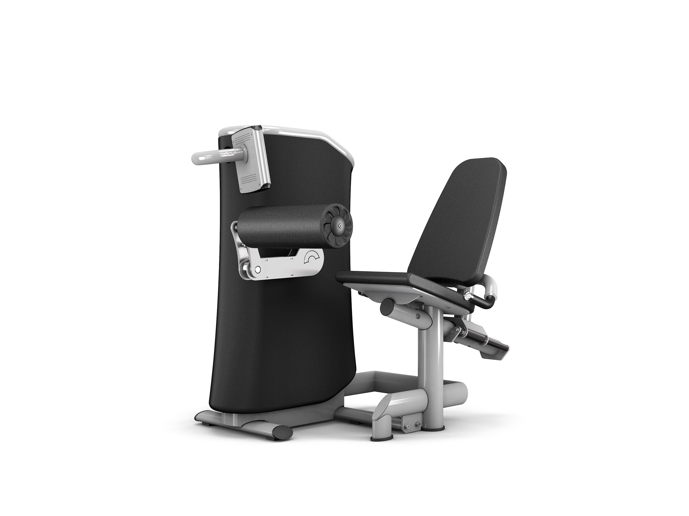
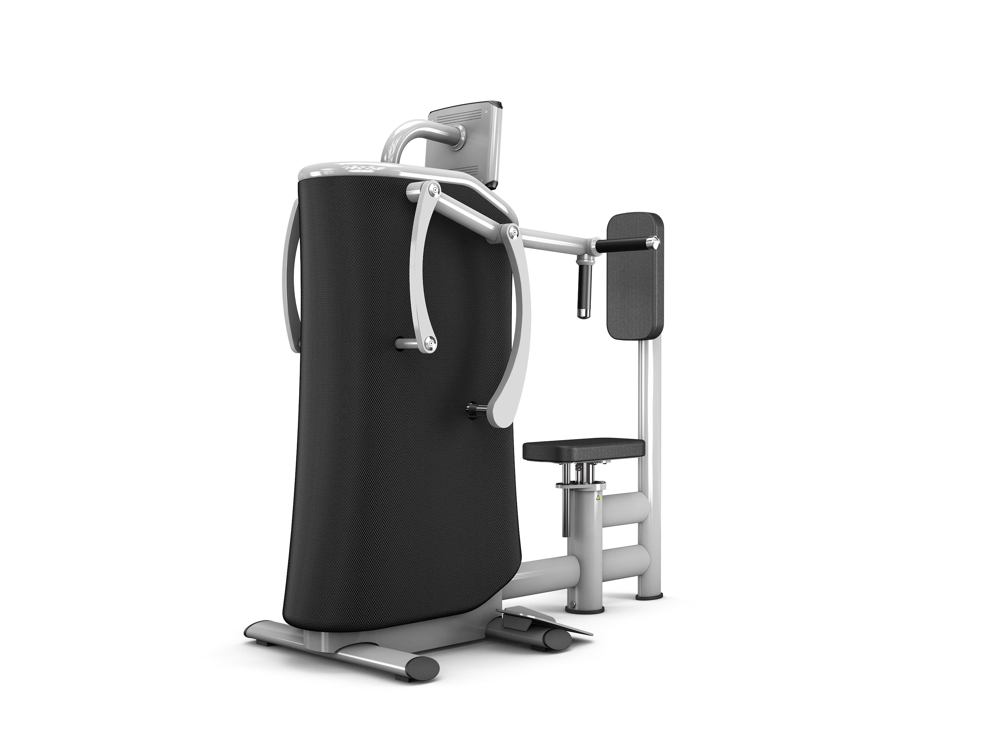

import { Grid } from "@material-ui/core";

Personalisiertes Training für alle Zielgruppen:

Individuelle Ziele erfordern personalisiertes Training. Ob Muskelaufbau, allgemeine Fitness oder Figurtraining:
Unsere automatisch periodisierten Trainingsprogramme passen dein Training auf dein persönliches Trainingsziel
an. So trainierst du ab der ersten Einheit trainingswissenschaftlich ideal – und das ganz automatisch. EGYM Smart
Strength Maschinen bieten dir ein interaktives und motivierendes Trainingserlebnis, das vollständig integriert mit
unseren digitalen Lösungen funktioniert. Ausgerichtet auf persönliche Ziele, Fortschritte, und körperliche
Voraussetzungen, werden alle wichtigen Trainingsparameter automatisch berechnet und voreingestellt. Foto Zirkel
Fotos einzelne Geräte

<Grid container style={{width: "100%"}}>
  <Grid item xs={6} sm={3}>

  </Grid>
  <Grid item xs={6} sm={3}>

  </Grid>
  <Grid item xs={6} sm={3}>

  </Grid>
  <Grid item xs={6} sm={3}>

  </Grid>
  <Grid item xs={6} sm={3}>

  </Grid>
  <Grid item xs={6} sm={3}>

  </Grid>
  <Grid item xs={6} sm={3}>

  </Grid>
  <Grid item xs={6} sm={3}>

  </Grid>
  <Grid item xs={6} sm={3}>

  </Grid>
</Grid>
