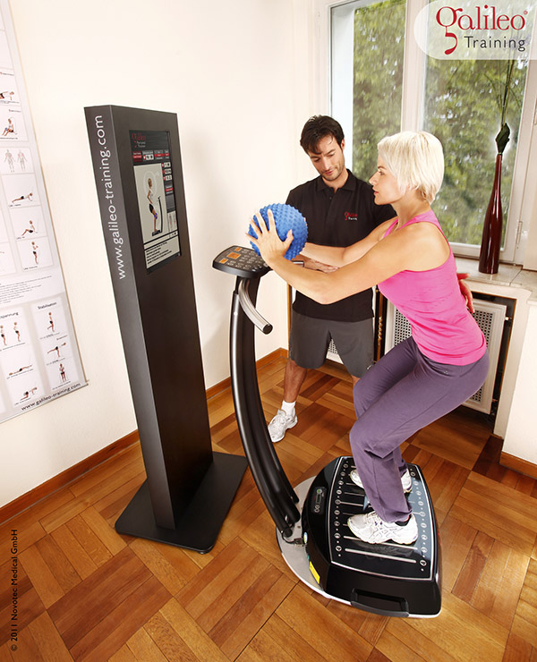
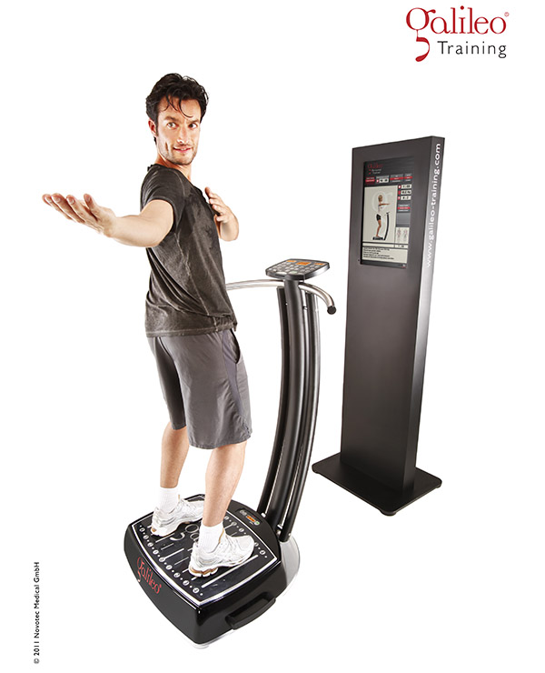
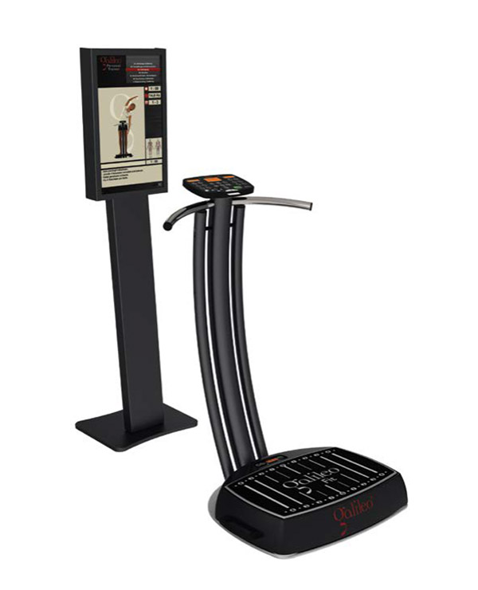

import { Grid } from "@material-ui/core";

Galileo kann Muskelkraft und -leistung wie auch die Ausdauerkapazität steigern. Darüber hinaus kann die hohe
Wiederholungsrate in kurzer Zeit zur Verbesserung der inter- und intramuskulären Koordination führen.
Trainingseffekte können verstärkt, Bewegungsmuster ausgeprägt, verfeinert und stabilisiert, Bewegungen dadurch
schneller und präziser werden. Ob Muskelaufbau, allgemeine Fitness oder Figurtraining sowie der Einsatz in
verschieden Bereichen der Prävention oder des Rehatrainings, Galileo ist die ideale Ergänzung für dein Training im
1a fit.

<Grid container style={{width: "100%", marginTop: 32}} spacing={2}>
  <Grid item xs={6} sm={4}>

  </Grid>
  <Grid item xs={6} sm={4}>

  </Grid>
  <Grid item xs={6} sm={4}>

  </Grid>
</Grid>
